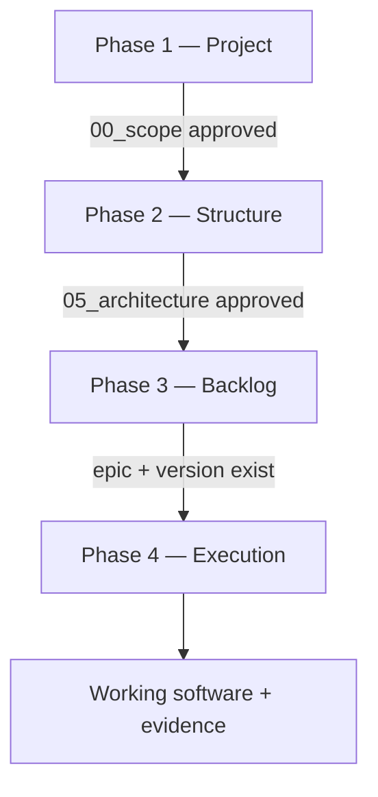

# Kanban local — Meridian test project

This repository is a **live demonstration** of [**Meridian**](https://github.com/colabcolibri/meridian) — document-driven project governance for AI-assisted development.

> **Meridian repo:** [github.com/colabcolibri/meridian](https://github.com/colabcolibri/meridian)  
> Phased docs, epics, user stories, kanban, and a structured decision log — a harness layer on top of Cursor or Claude Code. Chat does not persist. **Files do.**

The sample product built here is a **minimal local Trello**: an offline desktop app (Tauri + React + SQLite) with boards, columns, cards, drag-and-drop, and rich card metadata. The Kanban app is the demo; **the point of this repo is to show Meridian in action** — what changes when you stop "vibe coding" and start governing AI delivery.

### Relationship to the Meridian repo

| In [colabcolibri/meridian](https://github.com/colabcolibri/meridian) | In this repo (`exemplo`) |
| --- | --- |
| `.agent/` — portable harness kit (rules, agents, skills, workflows) | `.agent/` copied/synced from the kit |
| `docs/` — living spec in *your* project | `docs/` — scope, backlog, and US for Kanban local |
| `app-desktop/` · extension — observability (optional) | Not required; this demo runs in Cursor chat |

To use Meridian on your own project, clone or copy the kit from the [Meridian repository](https://github.com/colabcolibri/meridian), run `./.agent/scripts/sync_cursor_kit.sh`, then `/init-meridian` in your IDE. See the [Meridian README](https://github.com/colabcolibri/meridian#try-it-now) for full setup.

---

## The problem Meridian solves

Most AI-assisted projects look like this:

```text
You: "Build me a Trello clone"
AI:  [ dumps 40 files, mixed patterns, half the spec forgotten ]
You: "Fix the drag and drop"
AI:  [ rewrites unrelated files, breaks persistence ]
You: "Why did you pick Node instead of Tauri?"
AI:  [ no answer — the decision was never recorded ]
```

Without structure, agents **hallucinate scope**, **repeat decisions**, **skip requirements**, and **mark things done without evidence**. Every new chat session starts from zero context.

Meridian fixes this by making **`docs/` the source of truth** that both humans and agents read before writing code.

The core loop from the [Meridian project](https://github.com/colabcolibri/meridian):

```text
document → plan → refine → implement → close → commit
```

Chat does not persist. Files do.

---

## What Meridian gives you

| Without Meridian | With Meridian |
| --- | --- |
| One giant prompt → opaque codebase | Phased docs → agreed scope, stack, architecture |
| "It works on my machine" | User stories with acceptance criteria and test plans |
| AI decides stack mid-flight | Decisions logged in `docs/decisions/` with rationale |
| No audit trail | Every closed US has a **Record**: files touched, commands run |
| Scope creep in every session | **Gates**: no backlog before architecture; no code before `ready: true` |
| Bug fixes become random patches | New version + epics + US (see v2 below) |

**In one sentence:** Meridian turns AI from a code generator into a **governed delivery pipeline** — you stay the manager, the agent executes slices you approved.

### Concrete value in this project

From **one product spec** and **~7 chat messages**, this repo contains:

- **11 phase documents** (scope, security, architecture, data model, API contracts…)
- **2 versions**, **9 epics**, **8 sprints**, **26 user stories** (all ✅)
- A **full desktop app** — v1 MVP + v2 Trello UX and bug fixes
- **Post-release corrections** tracked as new US (e.g. US-0026) instead of silent hotfixes

You can open any `docs/us/US-XXXX.md` and see *why* that slice exists, *how* it was planned, and *what* was actually built. For a concrete example, see [`docs/us/US-0002.md`](docs/us/US-0002.md) (SQLite migration with full Record).

→ **Full breakdown:** [From one prompt to a full project](#from-one-prompt-to-a-full-project) — complete prompt, `docs/` tree, and prompt-to-artifact mapping.

---

## How Meridian works

Meridian runs in **four phases**. Each phase unlocks the next — you cannot skip gates.



### Phase 1 — Project definition

*What are we building, for whom, and what is explicitly out?*

- `docs/00_scope.md` — problem, in/out of scope, assumptions
- `docs/03_user_types.md` — who uses the product

**Gate:** scope approved → unlocks technical docs.

### Phase 2 — Structure definition

*How will we build it?*

- Stack, security, code principles, architecture, database, API, environments
- Detail files under `docs/architecture/` (e.g. data model)

**Gate:** `05_architecture.md` approved → unlocks backlog creation.

### Phase 3 — Backlog definition

*What ships, in what order?*

| Artifact | Question it answers |
| --- | --- |
| **Version** (v1, v2) | What goes live in this release? |
| **Epic** (EPIC-01…) | What product capability are we building? |
| **Sprint** (v1-S1…) | What do we finish in this iteration? |
| **User story** (US-0001…) | What is the smallest executable slice? |

**Gate:** epic + version exist → user stories can be created.

### Phase 4 — Execution

Each user story is a **mini-contract**, not a ticket:

```text
/create-us     →  draft Intent + Plan (ready: false)
/refine-us       →  detailed Approach, architecture refs, tests (ready: true)
/implement-us    →  product code — one US per session
/complete-us     →  fill Record with evidence, mark ✅
/sync-board      →  regenerate docs/kanban/board.json
```

**Hard rules:**

- No product code without `ready: true`
- No ✅ without a filled **Record** (files, tests, commands executed)
- Agents do not approve their own docs — **you** set `approved`

---

## From one prompt to a full project

Everything in this repository traces back to **a single chat message** — a product spec plus three Meridian commands. No code was written in that first turn. Meridian read the spec, structured it into `docs/`, and only then unlocked implementation.

### The complete initial prompt

Sent in chat session `0c8dab77-c0bd-421e-954f-60371d8a9428`:

<details>
<summary><strong>Click to expand the full prompt</strong></summary>

```text
I want to build a local task-management app inspired by Trello — simple and direct,
no login, no real-time collaboration, and no internet dependency. The app will be used
individually on the user's computer, with data stored locally in SQLite.

The core idea is to organize activities in boards, columns, and cards. Each board
represents a project, work area, or workflow. Within each board, the user can create
columns such as "To Do", "In Progress", "Waiting", and "Done", but column names must be
fully editable. Cards represent tasks or work items and must be movable between columns
as work progresses.

The first screen must be the workspace itself, not a landing page. When opening the app,
the user should see their boards or the last board used. The expected experience is:
open the app, create a board, set up columns, create cards, and move tasks fluidly.

Suggested technology: Vite with React and TypeScript on the frontend. To run locally with
SQLite, Tauri can be used as a desktop app, or a local web app with a lightweight backend
in Node.js using Fastify or Express. The choice should prioritize simplicity, ease of
installation, and local stability.

Main features:
- Create, rename, select, and delete boards.
- Create, rename, reorder, and delete columns.
- Create, edit, duplicate, move, reorder, and delete cards.
- Drag and drop to move cards between columns and reorder cards within the same column.
- Automatic persistence in SQLite.
- No authentication, no users, no permissions, and no online sync.

Card characteristics:
- Required title.
- Optional free-text description.
- Status defined by the column the card is in.
- Optional priority, e.g. low, medium, and high.
- Optional colored labels/tags.
- Optional due date.
- Optional internal checklist with items that can be marked complete.
- Simple notes or comments field, with no collaborative history required.
- Visual indicator when the card is overdue.
- Created-at and updated-at timestamps.
- Ability to archive or delete the card.
- In the compact card view, show only the most important info: title, labels,
  priority, due date, and checklist progress.
- When clicking a card, open a view/modal with all editable details.

Visual and experience:
The UI must be clean, organized, and productive — like a real work tool. Columns should
appear side by side, with horizontal scrolling when needed. Cards should be compact,
readable, and easy to drag. Avoid excessive colors, explanatory text, or decorative
elements. The interface should be responsive for laptop and desktop, with good use of
space and clear actions.

Expected data model:
- Board: id, name, created_at, updated_at.
- Column: id, board_id, name, order.
- Card: id, column_id, title, description, priority, due_date, archived, order,
  created_at, updated_at.
- Tag: id, board_id, name, color.
- CardTag: card_id, tag_id.
- ChecklistItem: id, card_id, text, completed, order.

Deliver the project with clear instructions to install dependencies, start in development
mode, and produce a usable local build. The goal is a local, minimalist Trello: useful,
fast, and stable, without unnecessary features.

/create-us /create-epic /create-sprint
Start the project from Meridian, complete — including sprints, user stories, and epics.
```

</details>

Three things made this work as a Meridian input:

1. **Product language** — problem, users, features, out-of-scope, visual expectations
2. **Technical hints** — stack options, data model entities
3. **Meridian commands** — not "just build it", but "structure the backlog first"

---

### What Meridian created from that prompt

Meridian did not jump to code. It ran the **document → plan** steps first:

```text
Your spec
    │
    ├─► Phase docs (00–08, 11)     ← WHAT and HOW to build
    ├─► architecture/ detail        ← data model, UI patterns
    ├─► versions/v1.md              ← MVP release boundary
    ├─► epics/ EPIC-01…07           ← 7 product capabilities
    ├─► sprints/ v1-S1…S6             ← 6 delivery iterations
    ├─► us/ US-0001…0020             ← 20 executable slices
    ├─► decisions/                    ← Tauri chosen over Node
    └─► kanban/board.json             ← derived board view
         │
         ▼  (after /refine-us + /implement-us)
    src/ + src-tauri/                 ← product code, slice by slice
```

#### Prompt section → Meridian artifact

| Part of your prompt | Where it landed in `docs/` |
| --- | --- |
| "Local Trello, no login, offline, SQLite" | [`00_scope.md`](docs/00_scope.md) — in/out of scope, assumptions |
| "Used individually on the user's computer" | [`03_user_types.md`](docs/03_user_types.md) — single local user |
| "Vite + React + TS; Tauri or Node" | [`01_tech_stack.md`](docs/01_tech_stack.md) + decision log → **Tauri 2 chosen** |
| "No authentication, local data" | [`02_security.md`](docs/02_security.md) — local-only threat model |
| Board / Column / Card / Tag / Checklist | [`architecture/data-model.md`](docs/architecture/data-model.md) + [`06_database.md`](docs/06_database.md) |
| Boards, columns, cards CRUD | EPIC-02, EPIC-03, EPIC-04 + US-0005…0012 |
| Drag and drop | EPIC-06 + US-0018 |
| Cards: tags, checklist, due date, modal | EPIC-05 + US-0013…0017 |
| Clean UI, side-by-side columns, responsive | [`architecture/ui-kanban.md`](docs/architecture/ui-kanban.md) + US-0007, US-0019 |
| "Install, dev, and build instructions" | EPIC-07 + US-0020 |
| Commands `/create-us /create-epic /create-sprint` | Full backlog in `docs/epics/`, `docs/sprints/`, `docs/us/` |

Every requirement in the prompt has a **traceable home** — either a phase doc, an epic, or a user story. Nothing lives only in chat memory.

---

### How `docs/` organized itself

Meridian follows a fixed folder contract. After the first prompt, `docs/` looked like this:

```text
docs/
│
├── 00_scope.md              ← Phase 1: what the product is and is NOT
├── 03_user_types.md         ← Phase 1: who uses it
│
├── 01_tech_stack.md         ← Phase 2: Tauri + React + SQLite
├── 02_security.md           ← Phase 2: local app, no auth
├── 04_principles.md         ← Phase 2: DRY, SRP, layer rules
├── 05_architecture.md       ← Phase 2: GATE — modules, boundaries
├── 06_database.md           ← Phase 2: SQLite, migrations
├── 07_api_contracts.md      ← Phase 2: Tauri commands (invoke)
├── 08_environments.md       ← Phase 2: dev local setup
├── 11_decisions.md          ← Index for decision log
│
├── architecture/            ← Detail referenced from 05
│   ├── data-model.md        ← Board, Column, Card, Tag, ChecklistItem DDL
│   └── ui-kanban.md         ← Column layout, compact card, modal
│
├── decisions/
│   └── 2026-07-02.json      ← Why Tauri, why v2 was opened later
│
├── versions/                  ← Phase 3: release packages
│   ├── v1.md                  ← MVP kanban local (20 US)
│   └── v2.md                  ← Trello UX + DnD fix (added after dogfood)
│
├── epics/                     ← Phase 3: product capabilities
│   ├── EPIC-01 … EPIC-07      ← Created from initial prompt (v1)
│   └── EPIC-08 … EPIC-09      ← Added when dogfood found gaps (v2)
│
├── sprints/                   ← Phase 3: time-boxed goals
│   ├── v1-S1 … v1-S6          ← 6 sprints covering v1
│   └── v2-S1, v2-S2           ← 2 sprints for v2 polish + hotfix
│
├── us/                        ← Phase 3+4: executable slices
│   └── US-0001 … US-0026      ← Each file = Intent + Plan + Record + Boundaries
│
└── kanban/
    └── board.json             ← Generated from us/*.md — never edit by hand
```

**Reading order for an agent:** scope → architecture → epic → US → code.  
**Reading order for a human:** start at [`docs/00_scope.md`](docs/00_scope.md), then pick any [`docs/us/US-XXXX.md`](docs/us/US-0002.md) to see the full lifecycle.

---

### Backlog created from the prompt (v1)

Meridian decomposed the spec into **version → epic → sprint → user story**:

```text
v1 — MVP local kanban
│
├── EPIC-01 Technical foundation       → v1-S1 → US-0001, US-0002, US-0003
├── EPIC-02 Boards and workspace       → v1-S2 → US-0004, US-0005, US-0006
├── EPIC-03 Kanban columns             → v1-S3 → US-0007, US-0008
├── EPIC-04 Cards core                 → v1-S4 → US-0009 … US-0012
├── EPIC-05 Card details and metadata  → v1-S5 → US-0013 … US-0017
├── EPIC-06 DnD and layout             → v1-S6 → US-0018, US-0019
└── EPIC-07 Delivery and README        → v1-S6 → US-0020
```

| Sprint | Goal | Stories |
| --- | --- | --- |
| v1-S1 | Tauri scaffold + SQLite schema | US-0001 Scaffold · US-0002 Migration · US-0003 Commands |
| v1-S2 | Board list and navigation | US-0004 Shell · US-0005 CRUD boards · US-0006 Last board |
| v1-S3 | Editable columns | US-0007 Horizontal layout · US-0008 Column CRUD |
| v1-S4 | Cards core | US-0009 Create · US-0010 Compact · US-0011 Move · US-0012 Archive |
| v1-S5 | Card details | US-0013 Modal · US-0014 Tags · US-0015 Checklist · US-0016 Due date · US-0017 Meta |
| v1-S6 | DnD + ship | US-0018 Drag-and-drop · US-0019 Responsive · US-0020 README |

After `/refine-us` (all stories) and `/implement-us` + `/complete-us`, each US got a **Record** — files changed, tests run, commands executed. Example: [`US-0002`](docs/us/US-0002.md) records the migration SQL, `cargo test`, and `pnpm tauri build`.

---

### What implementation produced (product code)

| Prompt requirement | Code delivered |
| --- | --- |
| Tauri + React + TypeScript | `src-tauri/`, `src/app/`, Vite config |
| SQLite persistence | `src-tauri/migrations/`, `src-tauri/src/db/` |
| Boards, columns, cards CRUD | `src/features/boards/`, `columns/`, `cards/` |
| Tauri invoke API | `src-tauri/src/commands/`, `src/domain/` types |
| Drag and drop | `@dnd-kit` in `src/features/boards/ui/BoardView.tsx` |
| Card modal, tags, checklist | `src/features/cards/` |
| Trello-like visual (v2) | `src/app/trello-theme.css`, US-0021–0025 |

---

### Follow-up prompts (same project, same process)

The initial prompt built v1. Later messages extended the backlog — never bypassing Meridian:

| # | Message | Meridian response |
| --- | --- | --- |
| 2 | `/refine-us` all stories | 20 US got Approach, architecture refs, `ready: true` |
| 3–4 | `/implement-us` → `/complete-us` | v1 code shipped slice by slice |
| 5 | "Dev only, no compile" | Scoped to `pnpm tauri dev` |
| 6 | `invoke` undefined in browser | Documented: must run inside Tauri window |
| 7 | DnD clones cards, UI looks bad | **v2** opened: EPIC-08/09, US-0021–0025, decision logged |
| 8 | Modal crash after v2 visual | **v2-S2**: US-0026 — fix without rewriting v1 |

This is the key difference: feedback becomes **versioned backlog**, not chat spaghetti.

### Current status

- **v1 (US-0001–US-0020):** ✅ MVP — CRUD, modal, DnD, persistence
- **v2 (US-0021–US-0026):** ✅ Trello visual, DnD fix, modal hotfix

---

## Who is this for?

- **Managers / product owners** using AI agents — you keep control of scope and approval
- **Developers** who want AI output that matches agreed architecture
- **Teams** tired of re-explaining the same decisions every chat session
- **Anyone evaluating [Meridian](https://github.com/colabcolibri/meridian)** — this repo is the proof, not a slide deck

### Get Meridian

- **Repository:** [github.com/colabcolibri/meridian](https://github.com/colabcolibri/meridian)
- **Live demo:** [colabcolibri.github.io/meridian](https://colabcolibri.github.io/meridian/)
- **VS Code extension:** [Meridian Harness on Marketplace](https://marketplace.visualstudio.com/items?itemName=colabcolibri.meridian-vscode) (board + planning in the editor)
- **Quick start:** clone Meridian → sync kit → `/init-meridian` → `/agents-help`

---

## Quick command reference

| Command | When to use |
| --- | --- |
| `/init-meridian` | Bootstrap `docs/` on a new or existing repo |
| `/status` | Where am I? What's blocked? |
| `/create-version` `/create-epic` `/create-sprint` `/create-us` | Build backlog after architecture gate |
| `/refine-us US-XXXX` | Prepare a story for implementation |
| `/implement-us US-XXXX` | Write product code for one slice |
| `/complete-us US-XXXX` | Close with evidence |
| `/sync-board` | Refresh kanban JSON |
| `python3 .agent/scripts/validate_meridian.py .` | Validate Meridian structure (optional) |

Deep dive: [Meridian protocol](https://github.com/colabcolibri/meridian) · [`.agent/references/start-here.md`](.agent/references/start-here.md) · [`docs/README.md`](docs/README.md)

---

## How to run the app

### Prerequisites

- [Node.js](https://nodejs.org/) 20 LTS+
- [pnpm](https://pnpm.io/) 9+
- [Rust](https://www.rust-lang.org/tools/install) (stable)

### Install & dev

```bash
git clone https://github.com/colabcolibri/meridian-trello-test.git
cd meridian-trello-test
pnpm install
pnpm approve-builds esbuild   # if prompted
pnpm tauri dev                # opens desktop window — required for Tauri invoke/API
```

```bash
pnpm lint          # ESLint
pnpm build         # frontend build
pnpm tauri build   # installable binary (optional)
```

> **Note:** `pnpm dev` alone opens Vite in the browser but **will not work** — SQLite and Rust commands exist only inside the Tauri window.

### Happy path

1. App opens → last board or board list
2. Create board → default columns (To Do, In Progress, Waiting, Done)
3. Add cards, click to edit details (tags, checklist, due date…)
4. Drag between columns
5. Close and reopen → data persists in SQLite

### Database location

| OS | Path |
| --- | --- |
| macOS | `~/Library/Application Support/com.sergiolucianojr.kanban-local/kanban.db` |
| Linux | `~/.local/share/com.sergiolucianojr.kanban-local/kanban.db` |
| Windows | `%APPDATA%\com.sergiolucianojr.kanban-local\kanban.db` |

---

## Repository layout

```text
docs/                # Meridian source of truth — see tree above
.agent/              # Meridian kit from github.com/colabcolibri/meridian
src/                 # React frontend (built from docs/us/)
src-tauri/           # Rust backend + SQLite
```

---

## License

Personal use / example project.
