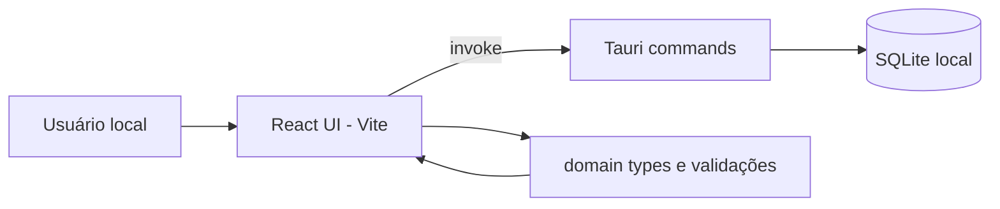

# Arquitetura — Kanban local

## Objetivo

Entregar um app desktop Tauri com UI React que manipula quadros kanban persistidos em SQLite local, com separação clara entre domínio, features, UI e commands Rust.

## Contexto do sistema

## Camadas e limites

| Camada | Path | Pode chamar |
| ------ | ---- | ----------- |
| UI | `src/app`, `src/components`, `src/features/*/ui` | features hooks, domain types |
| Features | `src/features/*` | Tauri invoke, domain |
| Domain | `src/domain/` | nada externo |
| Backend | `src-tauri/src/` | SQLite, filesystem app data |

## Fluxo principal

1. App abre → carrega lista de quadros ou último `board_id` usado (preferência local).
2. Usuário seleciona quadro → carrega colunas ordenadas por `order`.
3. Cada coluna lista cartões não arquivados, ordenados por `order`.
4. Mutação na UI → command Tauri → transação SQLite → retorno tipado → UI atualiza.
5. Cartão clicado → modal de detalhes com todos os campos editáveis.

## Modelo de dados

| Entidade | Campos principais |
| -------- | ----------------- |
| **Board** | id, name, created_at, updated_at |
| **Column** | id, board_id, name, order |
| **Card** | id, column_id, title, description, priority, due_date, archived, order, created_at, updated_at, notes |
| **Tag** | id, board_id, name, color |
| **CardTag** | card_id, tag_id |
| **ChecklistItem** | id, card_id, text, completed, order |
| **Project** (v3) | id, name, description, timestamps |
| **Version** | id, project_id, title, status, outcome |
| **Epic** | id, project_id, title, status, outcome |
| **Sprint** | id, project_id, version_id, title, status, goal |
| **UserStory** | id, project_id, epic/version/sprint FKs, Intent/Plan fields, workflow_column_id, order |
| **AcceptanceCriterion** | id, story_id, text, checked, order |

Detalhe SQL agile: [architecture/data-model.md](architecture/data-model.md) — § Modelo agile (v3).

## Integrações

- _n/a_ rede externa na v1.
- `@tauri-apps/api` para invoke de commands.
- Plugin SQL ou rusqlite no sidecar Rust.

## Detalhes de arquitetura

| Arquivo | Conteúdo |
| ------- | -------- |
| [architecture/data-model.md](architecture/data-model.md) | Schema SQL, índices, relações |
| [architecture/ui-kanban.md](architecture/ui-kanban.md) | Layout kanban, modal, DnD |

## Decisões registradas

- Tauri escolhido sobre stack web+Node — ver `docs/decisions/2026-07-02.json`.
